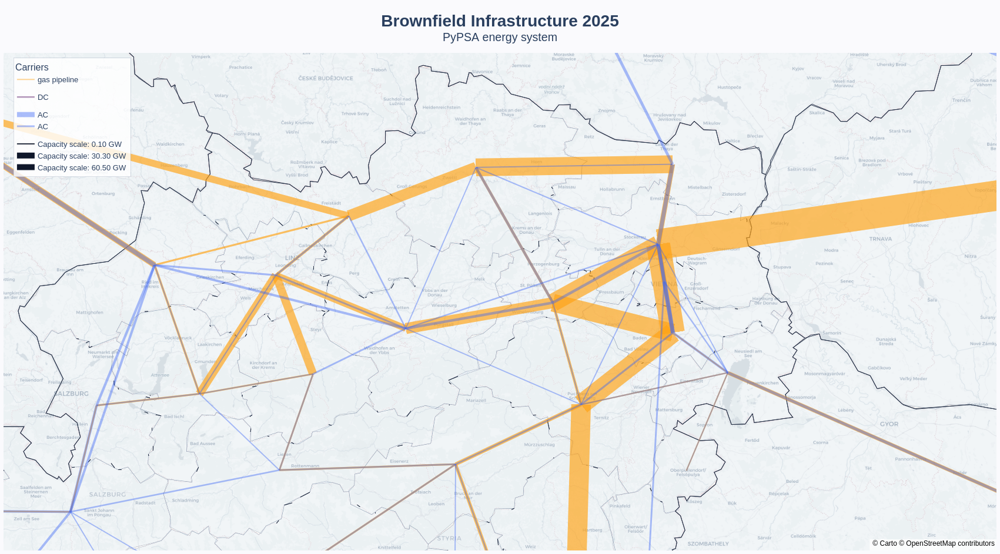
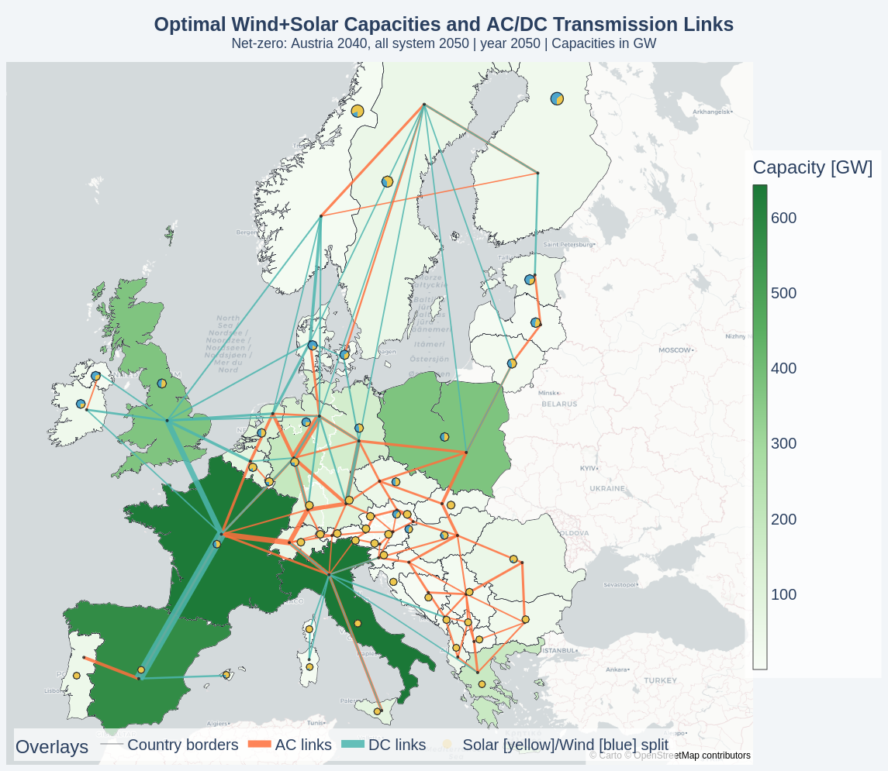
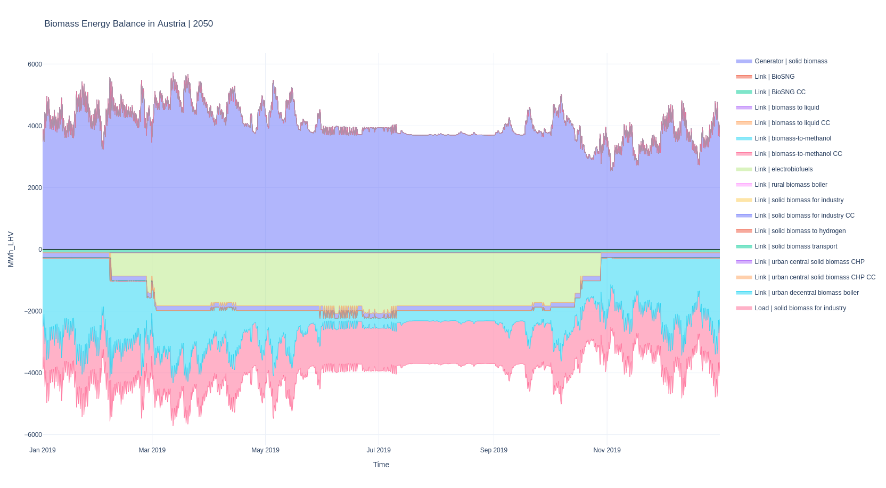
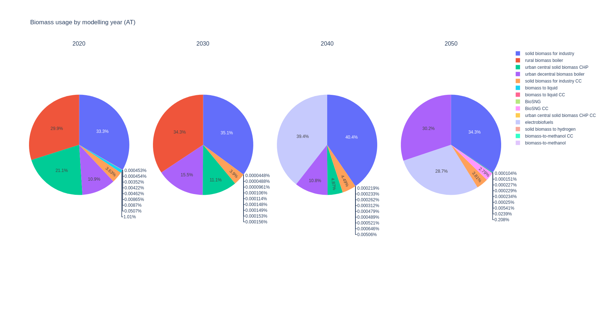
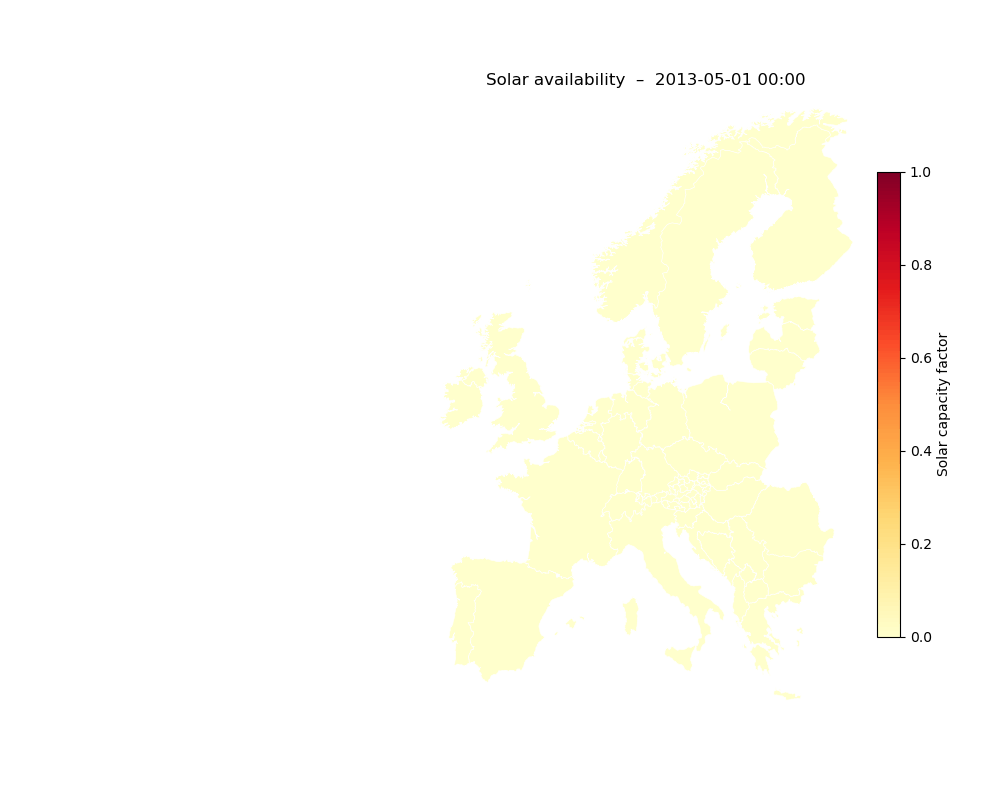
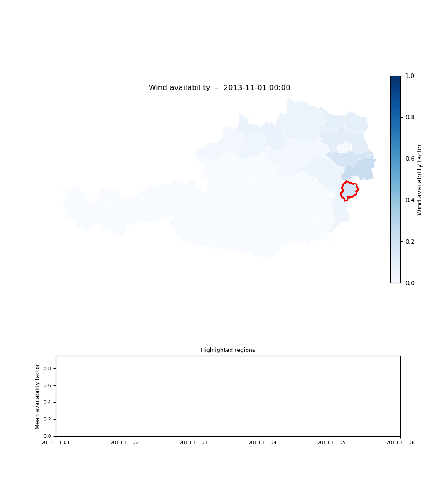

# pypsa-evaluations
This repository is a collection of various specific evaluations of pypsa-networks

## Included Scripts 
- [Austria Network Visualization](#austria-network-visualization)
- [Brownfield Infrastructure Visualization](#brownfield-infrastructure-visualization)
- [Renewables Usage Visualization](#renewables-usage-visualization)
- [Carrier Usage Visualization](#carrier-usage-visualization)
- [Animated Renewable Availability](#animated-renewable-availability)

## Austria Network Visualization

### Overview

[`plot_austria_network.py`](plot_austria_network.py) generates a publication-ready, static PNG map of the PyPSA-Eur transmission network with a focus on the Austrian territory.

The output figure shows:

- **Austria polygon** filled in a bright blue colour, all other countries hidden
- **Transmission lines** (AC) in orange, widths proportional to `s_nom`
- **Transmission links** (DC) in coral/red, widths proportional to `p_nom`
- **No buses** drawn
- **Fully transparent** figure and axes background (PNG alpha channel)

### Usage

```bash
python plot_austria_network.py
```

Edit the constants at the top of the script to point to your files before running:

| Constant | Description |
|----------|-------------|
| `NETWORK_FILE` | Path to the PyPSA network file (`.nc`) |
| `REGIONS_ONSHORE_FILE` | Path to onshore region polygons (GeoJSON / shapefile) |
| `OUTPUT_PNG` | Destination path for the output PNG |
| `AUSTRIA_KEY` | Index label for Austria in the regions file (default `"AT"`) |

### Requirements

Set up the environment with [pixi](https://pixi.sh):

```bash
pixi install
pixi run python plot_austria_network.py
```

Or install dependencies manually:

```bash
pip install pypsa geopandas matplotlib cartopy shapely
```

- `pypsa` – network I/O and plotting
- `geopandas` – spatial filtering and polygon rendering
- `matplotlib` – figure creation and PNG export
- `cartopy` – (optional) geographic projections
- `shapely` – geometry operations

### Notes

- **Region index key**: the loader first attempts an exact match on `AUSTRIA_KEY`, then falls back to a prefix match (e.g. `"AT0"`, `"AT11"` …).  Adjust `AUSTRIA_KEY` if your regions file uses a different identifier.
- **PyPSA / pandas ≥ 2.0 compatibility**: the script applies a minimal monkey-patch to `pypsa.plot` to work around a known dtype-handling bug (confirmed in PyPSA 1.1.2) that causes `TypeError` when colours are derived from plain string scalars on pandas ≥ 2.0.  The patch is a no-op on versions where the bug is already fixed.

---

## Brownfield Infrastructure Visualization

### Overview

[`plot_brownfield_infrastructure.py`](plot_brownfield_infrastructure.py) generates an interactive Plotly map showing inter-regional transmission infrastructure (links and lines) with capacity-scaled line widths and carrier-based coloring. The visualization displays:

- **Regional polygons**: Geographic boundaries with subtle shading
- **Country borders**: Overlaid for geographic context
- **Transmission links and lines**: Scaled by capacity, colored by carrier type (AC, DC, gas, hydrogen, etc.)
- **Interactive hover information**: Display capacity in GW for each connection
- **Legend**: Toggle carriers on/off, capacity scale reference
- **Optional city markers**: Major cities can be highlighted on the map

### Usage

```bash
python plot_brownfield_infrastructure.py
```

### Configuration

Adjust these constants at the top of the script to customize the visualization:

| Constant | Description |
|----------|-------------|
| `NETWORK_PATH` | Path to the PyPSA network file (.nc) |
| `REGIONS_PATH` | Path to region polygons (GeoJSON) |
| `FALLBACK_REGIONS_PATH` | Fallback regions file if primary doesn't match network locations |
| `OUTPUT_HTML` | Output path for interactive HTML map |
| `OUTPUT_STATIC` | Output path for static image (PNG/SVG) |
| `COUNTRY_ONLY` | Restrict visualization to a specific country (e.g., `"AT"`) or `None` for all |
| `PLOT_LINES` | Show AC transmission lines (`True`/`False`) |
| `PLOT_LINKS` | Show DC/other links (`True`/`False`) |
| `SHOW_MAJOR_CITIES` | Display major European cities on map (`True`/`False`) |
| `EVALUATION_MODE` | `"installed"` (default) or `"pathway_bounds"` to render min/max capacity bounds |
| `CARRIERS_FILTER` | Filter to specific carriers (e.g., `{"AC", "DC"}`) or `None` for all |
| `MAP_STYLE` | Plotly map style (e.g., `"carto-positron"`) |
| `EDGE_OPACITY` | Line opacity (0.0–1.0) |
| `MIN_WIDTH` / `MAX_WIDTH` | Line width range in pixels |

### Example output 


---

### Overview

This script generates an interactive map visualization of optimal wind and solar capacities across geographic regions, along with AC/DC transmission links. It analyzes a PyPSA network model and produces a Plotly-based HTML map showing:

- **Regional renewable capacities**: Choropleth coloring indicates total wind + solar capacity (GW) per region
- **Transmission links**: AC and DC inter-region connections scaled by capacity
- **Country borders**: Overlaid for geographic context
- **Optional pie charts**: Regional breakdown of solar vs. wind generation (togglable)

### Usage

```bash
python renewables_usagemap.py
```

The script reads from the network file specified by `NETWORK_PATH` and outputs an interactive HTML map to `OUTPUT_HTML`.

### Configuration

The script includes several toggles at the top of the file:

| Setting | Description |
|---------|------------|
| `NETWORK_PATH` | Path to the PyPSA network file (.nc format) |
| `FALLBACK_REGIONS_PATH` | Path to region geometries (GeoJSON) for map polygons |
| `OUTPUT_HTML` | Output file path for the generated interactive map |
| `EVALUATE_AUSTRIA_ONLY` | When `True`, only evaluates regions with names starting with "AT" |
| `SHOW_REGION_PIE_CHARTS` | When `True`, displays pie charts showing solar/wind split per region |
| `PIE_RADIUS_DEG` | Size of pie chart overlays (in map degrees) |

### Output

The script generates an interactive HTML map (`renewables_links_map.html`) with:

- **Hover information**: Click on regions or links to see detailed capacity data
- **Interactive legend**: Toggle overlays on/off
- **Zoom and pan**: Explore different map areas
- **Responsive design**: Works in modern web browsers

### Requirements

- `pypsa`: Network analysis library
- `geopandas`: Geospatial data handling
- `pandas`: Data manipulation
- `plotly`: Interactive visualization
- `shapely`: Geometry operations (via geopandas)

### Example Output



The generated map displays:
- Wind+solar capacity scaled by region color intensity
- AC transmission links in orange, DC links in teal
- Wind (blue) and solar (yellow) pie chart splits at each region (if enabled)
- Informative hover tooltips with capacity values in GW

---

## Carrier Usage Visualization

### Usage

Run the script directly:

```bash
python carrier_usage.py
```

The script loads one selected network (`SINGLE_NETWORK_FILE`) and a collection of model-year networks from `NETWORKS_FOLDER`.

### What It Produces

- A stacked time-series plot of biomass-related energy balance for Austria
- A single pie chart for the selected year (`PIE_SINGLE_TITLE`)
- A subplot figure with one pie chart per model year (`MODEL_YEARS`)

### Quick Configuration

Adjust these constants at the top of [carrier_usage.py](carrier_usage.py):

- `NETWORKS_FOLDER`: folder containing `.nc` files for the network collection
- `SINGLE_NETWORK_FILE`: one `.nc` file used for the time-series and single-year pie chart
- `MODEL_YEARS`: labels for the per-year pie charts (must align with loaded networks)
- `BUS_CARRIERS`, `EXCLUDED_CARRIER`, `ABSOLUTE_VALUES`: carrier filtering and value handling
- `PLOT_RENDERER`: Plotly renderer (for example `browser`)

### Example Output
+
+

---

## Animated Renewable Availability



### Overview

[`animate_renewable_profiles.py`](animate_renewable_profiles.py) generates two
animated visualisations – one for **onshore wind** and one for **solar** –
that show how the hourly capacity availability factor changes per region over a user-defined
time window.  Output is **MP4** (when `ffmpeg` is available on the system) or
**GIF** (automatic fallback using Pillow).

Each frame shows all regions coloured by their capacity availability factor at that hour:

- **Wind** – `Blues` colormap (0 = white, 1 = dark blue)
- **Solar** – `YlOrRd` colormap (0 = white, 1 = dark orange/red)
- Regions with no matching profile value are shown in grey.
- The current timestamp is displayed as the figure title.
- A colorbar indicates the capacity-factor scale.

### Usage

```bash
python animate_renewable_profiles.py
```

Edit the constants at the top of the script to point to your files before
running:

| Constant | Description |
|---|---|
| `WIND_PROFILE` | Path to `profile_adm_onwind.nc` |
| `SOLAR_PROFILE` | Path to `profile_adm_solar.nc` |
| `REGIONS_GEOJSON` | Path to the clustered `regions_onshore.geojson` |
| `START_DATE` | Start of animation window (ISO-8601, e.g. `"2013-01-01"`) |
| `END_DATE` | End of animation window (ISO-8601, e.g. `"2013-01-03"`) |
| `OUTPUT_WIND` | Destination path for the wind animation. Determine output format by suffix! (one of "mp4", "gif") |
| `OUTPUT_SOLAR` | Destination path for the solar animation. Determine output format by suffix! (one of "mp4", "gif") |
| `FPS` | Frames per second (default `12`) |
| `HIGHLIGHT_ENABLED` | Enable region-highlight mode (`True`/`False`) |
| `HIGHLIGHT_REGIONS` | List of region names (matching GeoJSON index) to highlight with a red border |
| `HIGHLIGHT_EDGE_COLOR` | Border colour for highlighted regions (default `"red"`) |
| `HIGHLIGHT_EDGE_WIDTH` | Border line width for highlighted regions (default `2.5`) |
| `HIGHLIGHT_TIMESERIES_ENABLED` | When `True`, a cumulative timeseries panel is rendered below the map showing the mean availability of the highlighted regions |
| `HIGHLIGHT_TIMESERIES_YLABEL` | Y-axis label for the timeseries panel |
| `FIGURE_SIZE_WITH_TIMESERIES` | Figure size `(width, height)` used when the timeseries panel is active |

> [!TIP]
> Be sure to read in the right Regions-File! The index of the Regions-file must match exactly to the Buses specified in the availability-files, so use file with **clustered** regions.

#### Region highlighting
Single or multiple regions can be highlighted (see Configuration variables above) and the mean availability profile for the respective region(s) is plotted as timeseries on the bottom of the animated map.



### Requirements

All required packages are declared in `pixi.toml` and installed by `pixi install`:

| Package | Purpose |
|---|---|
| `matplotlib >= 3.7` | Figure, animation, colormaps |
| `geopandas >= 0.14` | Region polygon I/O and plotting |
| `xarray >= 2023.1` | NetCDF file I/O |
| `numpy >= 1.24` | Numerical operations |
| `pandas >= 2.0` | Time-index handling |
| `pillow >= 9.0` | GIF export (fallback when `ffmpeg` absent) |

For **MP4 output**, `ffmpeg` is installed in pixi environment. If for some case, `ffmpeg` is not available, script automatically falls back to GIF-creation.

```bash
pixi install
pixi run python animate_renewable_profiles.py
```
